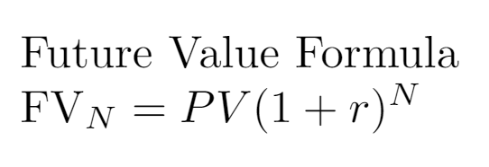

# Future Value
A calculator which helps you to calculate how many value your invested will have, created with python, javascript and made with love ♥ 

## usage
The basic principle behind the time value of money is simple: One dollar today is worth more than one dollar you will receive in the future. This is because you can invest the dollar you have today, and it can grow over time at a rate of return, or interest. The dollar that you receive “tomorrow” can’t be invested today, and therefore doesn’t have the same potential to increase in value

 

FV = Future Value

PV = Present Value

r = Interest rate

n = number of periods

You can try the [demo on this link](https://enigmatic-cliffs-29959.herokuapp.com/)

## how to install 

1. Install  [Python 3](https://www.python.org/downloads/).
2. Install virtual enviroment with:

    [`virtualenv venv`](#code).

3. Start the virtual enviroment with:

    [`source venv/bin/activate`](#code).

4. Install Flask and gunicorn libraries

    [`pip install fastapi uvicorn`](#code).

 Also you can install by the requirements txt

5. Run the server with

    [`flask run`](#code).

6. How to deploy in Heroku

    you can read the following steps for deploy on heroku  [on this link ](https://www.digitalocean.com/community/tutorials/how-to-make-a-web-application-using-flask-in-python-3-es)
